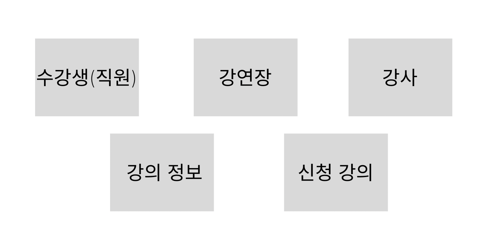

# lectures

수강 신청 api

----
## 구성
java 

jdk 17

spring boot 3.4.1

maria database

redis

---
## 데이터 구조

수강생과 강사를 구매자와 판매자 개념으로 엔티티를 나누고

강연장과 강의 정보를 상품 정보로 설정하듯 구성합니다.

마지막으로 신청완료된 정보들을 예약 목록 처럼 구성하기 위애 엔티티를 별도로 

나누었습니다.

---
## 기타

